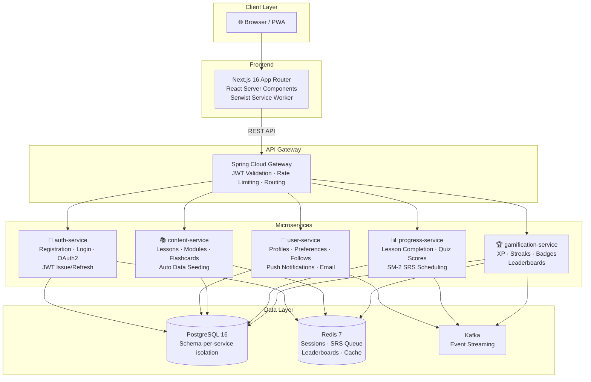
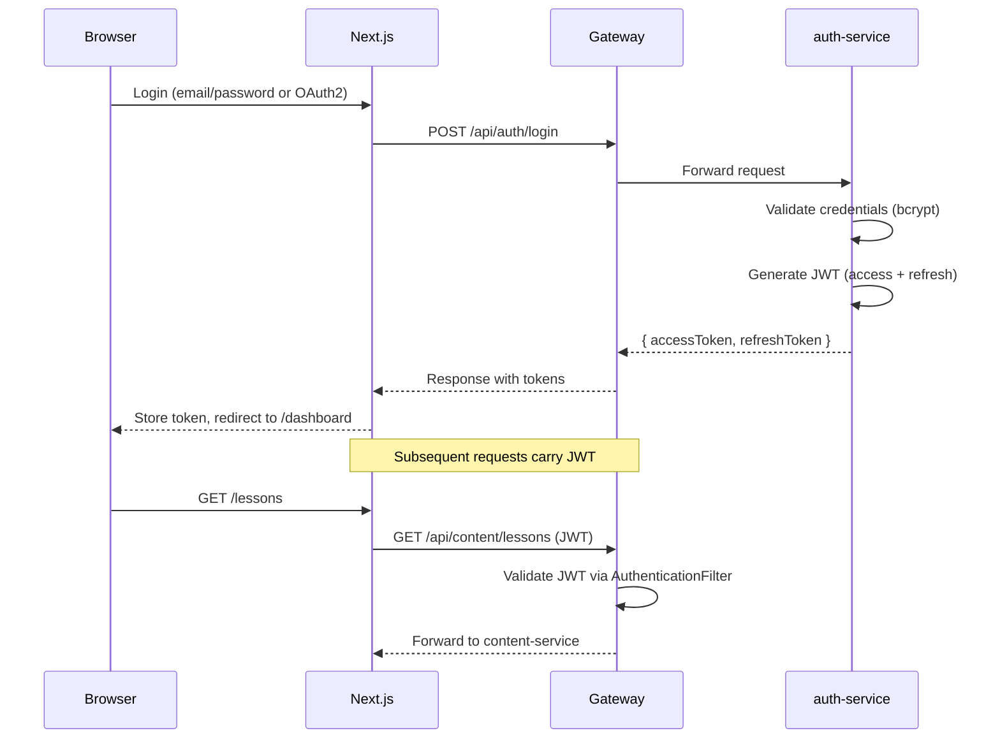
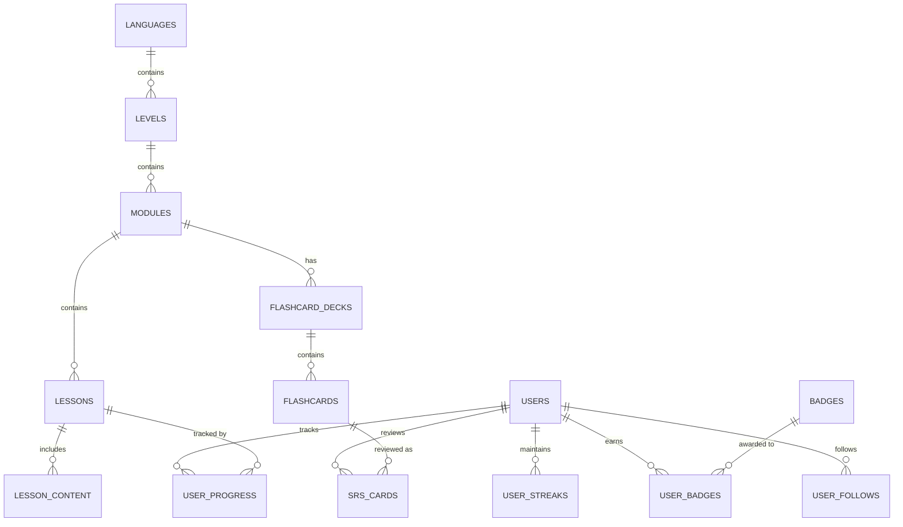
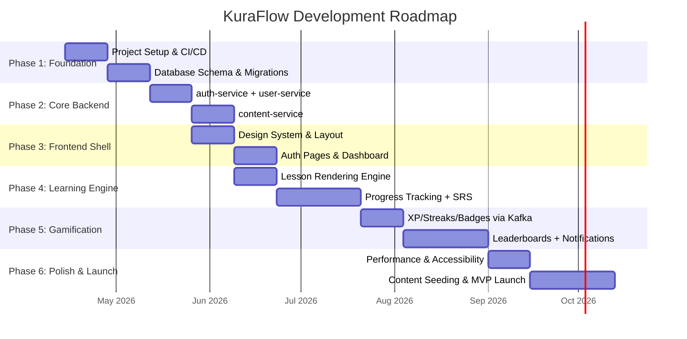

<div align="center">

# 🏔️ KuraFlow

### Master Japanese & English with Adaptive SRS & Gamified Learning

A microservices-based language learning platform for **English (CEFR A1–C2)** and **Japanese (JLPT N5–N1)** learners. Features an SM-2 spaced repetition engine, gamified XP/streak/badge systems, real-time leaderboards, a rich lesson player with Japanese furigana & pitch-accent support, and a PWA frontend with offline caching and web push notifications.

[](.github/workflows/ci.yml)
[](https://adoptium.net/)
[](https://spring.io/projects/spring-boot)
[](https://nextjs.org/)
[](https://react.dev/)
[](https://www.postgresql.org/)
[](https://redis.io/)
[](https://kafka.apache.org/)
[](https://www.docker.com/)
[](https://www.typescriptlang.org/)

</div>

---

## Table of Contents

- [Overview](#overview)
- [Key Features](#key-features)
- [Architecture](#architecture)
- [Technology Stack](#technology-stack)
- [Microservices](#microservices)
- [Database Schema](#database-schema)
- [Repository Structure](#repository-structure)
- [Getting Started](#getting-started)
- [Staging Deployment](#staging-deployment)
- [Environment Variables](#environment-variables)
- [CI/CD Pipeline](#cicd-pipeline)
- [Development Roadmap](#development-roadmap)
- [Non-Functional Requirements](#non-functional-requirements)

---

## Overview

KuraFlow is a full-stack language learning platform built on a microservices architecture. The name combines **Kura** (倉, "storehouse/treasury" in Japanese) with **Flow**, reflecting the philosophy of building a treasury of language knowledge through a seamless, flowing learning experience.

The platform supports two languages with internationally recognized proficiency frameworks:

| Language | Framework | Levels |
|----------|-----------|--------|
| English | CEFR | A1, A2, B1, B2, C1 |
| Japanese | JLPT | N5, N4, N3 |

Each level contains modules (Grammar, Vocabulary, Phrasal Verbs, Key Sentences, Flashcards) with structured lessons and 200+ flashcards per level, all auto-seeded from JSON data files on startup.

---

## Key Features

### Learning Engine
- **Adaptive Spaced Repetition (SRS)** — SM-2 algorithm schedules flashcard reviews at optimal intervals to maximize long-term retention. Cards progress through `LEARNING` → `REVIEW` → `GRADUATED` states.
- **Rich Lesson Player** — Multi-step content renderer supporting explanations, examples, and interactive quizzes with real-time scoring, confetti, and XP toasts.
- **Interactive Quiz Engine** — Multiple choice (MCQ), fill-in-the-blank, and sentence reordering with instant feedback and retry support.
- **Japanese-Specific UI** — Furigana ruby text annotations above kanji, pitch-accent markers, and native audio playback with animated waveforms.

### Gamification
- **XP & Leveling** — Earn XP from lessons (10 + score/10) and reviews (5 per card) to climb the ranks.
- **Streak System** — Timezone-aware daily streaks with streak freezes (purchasable for 100 XP) and scheduled cleanup of expired streaks.
- **Badge Engine** — Criteria-based badge evaluation (streak milestones, XP thresholds, completion counts, mastery/perfect scores) with bonus XP rewards and toast notifications.
- **Leaderboards** — Real-time weekly and all-time leaderboards powered by Redis sorted sets, plus a friends-only leaderboard.

### Platform
- **PWA** — Installable app with offline caching (lessons, images, API responses) via Serwist service worker.
- **Web Push Notifications** — VAPID-based push for badge earned and streak reminder alerts with client-side Japanese localization.
- **Email Reminders** — Scheduled streak reminder emails via Kafka-driven event consumers.
- **Social** — Follow/unfollow users, friends leaderboard, profile pages with badge showcases and activity history.
- **Security** — JWT access + refresh token rotation, bcrypt password hashing, OAuth2 (Google), Spring Cloud Gateway rate limiting, CSP and security headers.

---

## Architecture

KuraFlow follows a microservices architecture with an API Gateway pattern, event-driven communication via Kafka, and Redis for caching, sessions, and leaderboards.



### Communication Patterns

| Pattern | Where Used | Why |
|---------|-----------|-----|
| **Synchronous REST** | Next.js → Gateway → Services | Simple request/response for CRUD, auth, and content fetching |
| **Kafka Events (Async)** | progress-service → gamification-service | Lesson/review completion triggers XP/streak/badge recalculation without blocking the user |
| **Redis Cache** | content-service, SRS queues | Sub-ms flashcard retrieval; lesson content rarely changes → high cache hit ratio |
| **Redis Sorted Sets** | gamification-service | Real-time leaderboard rankings with O(log N) updates |
| **Redis Pub/Sub** | Streak reminders, badge alerts | Lightweight push notifications |

### Kafka Topics

| Topic | Producer | Consumer | Payload |
|-------|----------|----------|---------|
| `lesson.completed` | progress-service | gamification-service | `{ userId, lessonId, score, timestamp }` |
| `review.completed` | progress-service | gamification-service | `{ userId, cardId, quality, timestamp }` |
| `badge.earned` | gamification-service | user-service | `{ userId, badgeCode, badgeName, iconUrl, timestamp }` |
| `streak.updated` | gamification-service | user-service | `{ userId, currentStreak, isNewRecord, timestamp }` |
| `streak.reminder` | gamification-service | user-service | `{ userId, currentStreak, timestamp }` |

> The gamification-service consumer uses `@RetryableTopic` with 4 attempts, exponential backoff, and a dead letter topic (DLT) for failed events.

### Authentication Flow



---

## Technology Stack

| Layer | Technology | Version |
|-------|-----------|---------|
| **Backend** | Java | 21 |
| | Spring Boot | 3.2.4 |
| | Spring Cloud | 2023.0.1 |
| | Spring Cloud Gateway | (reactive/WebFlux) |
| | Spring Security + OAuth2 Client | (Google) |
| | Flyway | (managed by Spring Boot) |
| | Testcontainers | (integration tests) |
| | JJWT | 0.12.5 |
| | SpringDoc OpenAPI | 2.5.0 |
| | Web Push (nl.martijndwars) | 5.1.1 |
| **Frontend** | Next.js | 16.2.2 (App Router) |
| | React / React DOM | 19.2.4 |
| | TypeScript | 5 |
| | Tailwind CSS | v4 |
| | Serwist (PWA/SW) | 9.5.11 |
| | ESLint / Prettier | 9 / 3.8.1 |
| **Data** | PostgreSQL | 16 |
| | Redis | 7 |
| | Apache Kafka (Confluent) | 7.5.3 |
| **DevOps** | Docker | Multi-stage builds |
| | GitHub Actions | CI (lint, test, build) |
| | Docker Compose | Local dev + staging |

---

## Microservices

All services share a common Maven parent (`kuraflow-parent`) and a `shared-lib` module containing JWT security filters, custom user details, and Kafka event DTOs.

| Service | Port | Base Path | Description |
|---------|------|-----------|-------------|
| **gateway-service** | 8080 | `/api/**` | API Gateway — routes requests, validates JWT, applies Redis-based rate limiting (10 req/s, burst 20), CORS |
| **auth-service** | 8081 | `/api/auth/**` | Authentication — registration, login, JWT issue/refresh, OAuth2 (Google), bcrypt hashing, Redis sessions |
| **user-service** | 8082 | `/api/users/**` | User management — profiles, preferences, follow/unfollow, web push subscriptions (VAPID), email reminders, Kafka notification consumers |
| **content-service** | 8083 | `/api/content/**` | Content delivery — languages, levels, modules, lessons (polymorphic JSONB), flashcard decks, Redis caching, auto data seeding from JSON |
| **progress-service** | 8084 | `/api/v1/progress/**`, `/api/v1/srs/**` | Progress tracking — lesson completion, quiz scores, SM-2 SRS scheduling, Kafka event publishing |
| **gamification-service** | 8085 | `/api/gamification/**` | Gamification — XP calculation, timezone-aware streaks (with freezes), badge engine, Redis sorted-set leaderboards, Kafka consumers with retry/DLT |

<details>
<summary><b>Service API Endpoints</b></summary>

### auth-service
| Method | Endpoint | Description |
|--------|----------|-------------|
| `POST` | `/api/auth/register` | Register new user |
| `POST` | `/api/auth/login` | Login with email/password |
| `POST` | `/api/auth/refresh` | Refresh access token |
| `GET` | `/api/auth/health` | Health check |

### user-service
| Method | Endpoint | Description |
|--------|----------|-------------|
| `GET` | `/api/users/me` | Get current user profile |
| `GET` | `/api/users/{id}` | Get user by ID |
| `GET` | `/api/users/email/{email}` | Get user by email |
| `PATCH` | `/api/users/me` | Update current user |
| `POST` | `/api/users/me/following/{targetId}` | Follow a user |
| `DELETE` | `/api/users/me/following/{targetId}` | Unfollow a user |
| `GET` | `/api/users/{id}/following` | Get following list |
| `GET` | `/api/users/{id}/followers` | Get followers list |
| `POST` | `/api/users/notifications/subscribe` | Subscribe to web push |

### content-service
| Method | Endpoint | Description |
|--------|----------|-------------|
| `GET` | `/api/content/languages` | List all languages |
| `GET` | `/api/content/levels?languageId=` | List levels for a language (paginated) |
| `GET` | `/api/content/modules?levelId=` | List modules for a level (paginated) |
| `GET` | `/api/content/lessons?moduleId=` | List lessons for a module (paginated) |
| `GET` | `/api/content/lessons/{id}` | Get full lesson detail with content items |
| `GET` | `/api/content/flashcards?deckId=` | List flashcards in a deck |
| `GET` | `/api/content/flashcards/search?tag=` | Search flashcards by tag |
| `GET` | `/api/content/flashcards/decks?moduleId=` | List flashcard decks for a module |

### progress-service
| Method | Endpoint | Description |
|--------|----------|-------------|
| `POST` | `/api/v1/progress/lessons/{lessonId}` | Save lesson progress |
| `GET` | `/api/v1/progress/lessons/{lessonId}` | Get lesson progress |
| `GET` | `/api/v1/srs/cards/due` | Get due SRS cards |
| `POST` | `/api/v1/srs/cards/{flashcardId}/review` | Submit a card review (SM-2) |

### gamification-service
| Method | Endpoint | Description |
|--------|----------|-------------|
| `GET` | `/api/gamification/streak/me` | Get current user's streak |
| `POST` | `/api/gamification/streak/me/freeze` | Purchase a streak freeze (100 XP) |
| `GET` | `/api/gamification/leaderboard/alltime` | All-time leaderboard |
| `GET` | `/api/gamification/leaderboard/weekly` | Weekly leaderboard |
| `GET` | `/api/gamification/leaderboard/friends` | Friends leaderboard |
| `GET` | `/api/gamification/profile/me` | Get gamification profile |
| `GET` | `/api/gamification/profile/me/history` | Get activity history |

</details>

---

## Database Schema

KuraFlow uses **PostgreSQL 16** with **schema-per-service** isolation. Each microservice owns its schema and uses Flyway for migrations.



| Schema | Service | Key Tables |
|--------|---------|------------|
| `user_schema` | user-service | `users`, `user_follows`, `push_subscriptions`, `activity_log` |
| _(default)_ | content-service | `languages`, `levels`, `modules`, `lessons`, `lesson_content` (JSONB body), `flashcard_decks`, `flashcards` (JSONB front/back, GIN index on tags) |
| `progress_schema` | progress-service | `user_progress`, `srs_cards` (SM-2 fields with partial index `WHERE status != 'GRADUATED'`) |
| `gamification_schema` | gamification-service | `user_streaks` (totalXp, freezes, stats), `badges` (criteria JSONB), `user_badges` |

### Key Design Decisions

| Decision | Rationale |
|----------|-----------|
| **JSONB for lesson content** | Content types (MCQ, fill-blank, reorder, audio) have different shapes. JSONB provides polymorphic flexibility without complex table-per-type hierarchies. |
| **JSONB for flashcard front/back** | Japanese cards need `reading` (furigana), English cards need pronunciation. JSONB avoids NULL-heavy columns. |
| **UUID primary keys** | Required for distributed microservices — no cross-service auto-increment collisions. |
| **Separate `srs_cards` from `flashcards`** | `flashcards` is immutable system content. `srs_cards` is per-user mutable state. Clean separation of concerns. |
| **Partial index on `srs_cards`** | `WHERE status != 'GRADUATED'` excludes mastered cards from the "due review" query, dramatically improving SRS queue performance. |
| **GIN index on flashcard `tags`** | Enables fast filtering like "show all N5 verbs" using `@>` array containment. |

---

## Repository Structure

```
KuraFlow/
├── .github/
│   └── workflows/
│       └── ci.yml                  # CI pipeline (frontend lint+build, backend verify)
├── frontend/                       # Next.js 16 PWA (App Router, React 19, TypeScript)
│   ├── src/
│   │   ├── app/                    # Routes: landing, auth, dashboard, lessons, flashcards, leaderboard, profile, settings
│   │   ├── components/
│   │   │   ├── ui/                 # Design system: Button, Card, Badge, ProgressBar, Input, Toast, FuriganaText, AudioPlayer
│   │   │   ├── layout/            # MainLayout, Sidebar, Header, MobileNav, AuthLayout
│   │   │   ├── lesson/            # LessonPlayer, ExplanationRenderer, ExampleRenderer, LessonComplete
│   │   │   ├── quiz/              # MultipleChoiceQuiz, FillInTheBlankQuiz, SentenceReorderingQuiz, ScoreFeedback
│   │   │   └── srs/               # Flashcard (flip animation, SM-2 quality rating)
│   │   └── lib/                   # API client, types, push notifications, quiz score hook
│   ├── public/                    # PWA manifest, icons (192/512), service worker
│   ├── Dockerfile                 # Multi-stage build (node:22-alpine, standalone output)
│   └── package.json
├── services/                       # Spring Boot 3 microservices (Java 21, Maven)
│   ├── pom.xml                     # Parent POM (shared dependency management)
│   ├── shared-lib/                 # Shared: JWT security filter, CustomUserDetails, Kafka event DTOs
│   ├── auth-service/               # Port 8081 — Auth, JWT, OAuth2
│   ├── user-service/               # Port 8082 — Profiles, follows, push, email
│   ├── content-service/            # Port 8083 — Lessons, flashcards, seeding, Redis cache
│   ├── progress-service/           # Port 8084 — Progress, SM-2 SRS, Kafka producer
│   ├── gamification-service/       # Port 8085 — XP, streaks, badges, leaderboards
│   └── gateway-service/            # Port 8080 — API Gateway, routing, rate limiting
├── infra/
│   └── docker-compose.yml          # Local dev: PostgreSQL, Redis, Kafka, Zookeeper
├── docker-compose.staging.yml      # Full staging stack (infra + all services + frontend)
├── .env.example                    # Environment variable template
└── implementation_plan.md          # Full architecture blueprint & roadmap
```

---

## Getting Started

### Prerequisites

| Tool | Version | Purpose |
|------|---------|---------|
| [Docker](https://www.docker.com/) | Latest | Run infrastructure containers |
| [Java (JDK)](https://adoptium.net/) | 21+ | Build & run Spring Boot services |
| [Maven](https://maven.apache.org/) | 3.9+ | Backend build tool |
| [Node.js](https://nodejs.org/) | 20+ | Frontend runtime |
| [npm](https://www.npmjs.com/) | 10+ | Frontend package manager |

### 1. Clone the Repository

```bash
git clone https://github.com/<your-org>/KuraFlow.git
cd KuraFlow
```

### 2. Configure Environment

```bash
cp .env.example .env
```

Edit `.env` and fill in real values (database password, JWT secret, VAPID keys, mail password). See [Environment Variables](#environment-variables) for details.

### 3. Start Infrastructure Dependencies

Requires Docker running. This starts PostgreSQL, Redis, Kafka, and Zookeeper:

```bash
docker compose -f infra/docker-compose.yml up -d
```

Verify all containers are healthy:

```bash
docker compose -f infra/docker-compose.yml ps
```

### 4. Build & Start Backend Microservices

Build the shared library and all services:

```bash
cd services
mvn clean install -DskipTests
```

Open a **separate terminal** for each service (run from inside `services/`):

```bash
# Terminal 1 — Auth Service (port 8081)
cd auth-service && mvn spring-boot:run

# Terminal 2 — User Service (port 8082)
cd user-service && mvn spring-boot:run

# Terminal 3 — Content Service (port 8083)
cd content-service && mvn spring-boot:run

# Terminal 4 — Progress Service (port 8084)
cd progress-service && mvn spring-boot:run

# Terminal 5 — Gamification Service (port 8085)
cd gamification-service && mvn spring-boot:run

# Terminal 6 — API Gateway (port 8080) — start this LAST
cd gateway-service && mvn spring-boot:run
```

> Wait until each service logs `Started [ServiceName]Application` before starting the next. The content-service will auto-seed lesson and flashcard data on first startup.

### 5. Start the Frontend

```bash
cd frontend
npm install
npm run dev
```

### 6. Try It Out

Open [http://localhost:3000](http://localhost:3000) in your browser. You can now:

1. Register a new account
2. Select a language (English or Japanese) and proficiency level
3. Browse the module grid and start a lesson
4. Complete quizzes and earn XP
5. Review flashcards with the SRS engine
6. Check your streak and leaderboard ranking

---

## Staging Deployment

A full Docker Compose staging stack is provided, including all infrastructure, microservices, and the frontend:

```bash
# Copy and fill in environment variables
cp .env.example .env

# Build and start the entire stack
docker compose -f docker-compose.staging.yml up -d --build
```

This provisions:

| Container | Port | Service |
|-----------|------|---------|
| `KuraFlow-staging-gateway` | 8080 | API Gateway (staging profile) |
| `KuraFlow-staging-auth` | 8081 | Auth Service |
| `KuraFlow-staging-user` | 8082 | User Service |
| `KuraFlow-staging-content` | 8083 | Content Service |
| `KuraFlow-staging-progress` | 8084 | Progress Service |
| `KuraFlow-staging-gamification` | 8085 | Gamification Service |
| `KuraFlow-staging-frontend` | 3000 | Next.js Frontend |
| `KuraFlow-staging-postgres` | 5432 | PostgreSQL 16 |
| `KuraFlow-staging-redis` | 6379 | Redis 7 |
| `KuraFlow-staging-kafka` | 9092 | Kafka |

The frontend will be available at [http://localhost:3000](http://localhost:3000), and API requests route through the gateway at `http://localhost:8080/api`.

To tear down:

```bash
docker compose -f docker-compose.staging.yml down -v
```

---

## Environment Variables

Create a `.env` file in the project root based on `.env.example`:

| Variable | Required | Description |
|----------|----------|-------------|
| `DB_URL` | Yes | JDBC connection string (e.g. `jdbc:postgresql://localhost:5432/KuraFlow`) |
| `DB_USERNAME` | Yes | PostgreSQL username |
| `DB_PASSWORD` | Yes | PostgreSQL password |
| `JWT_SECRET` | Yes | HMAC-SHA secret key for JWT signing/verification |
| `MAIL_PASSWORD` | No | SMTP password for email reminders (dev: MailHog) |
| `VAPID_PUBLIC_KEY` | No | VAPID public key for web push notifications |
| `VAPID_PRIVATE_KEY` | No | VAPID private key for web push notifications |
| `VAPID_SUBJECT` | No | VAPID subject (e.g. `mailto:admin@kuraflow.com`) |

> The frontend also uses `NEXT_PUBLIC_API_URL` (defaults to `http://localhost:8080/api`) and `NEXT_PUBLIC_VAPID_PUBLIC_KEY` in `.env.local`.

---

## CI/CD Pipeline

The [GitHub Actions workflow](.github/workflows/ci.yml) runs on every push and pull request to `main`:

| Job | Runner | Steps |
|-----|--------|-------|
| **frontend-ci** | `ubuntu-latest`, Node 20 | `npm ci` → `npm run lint` → `npm run build` |
| **backend-ci** | `ubuntu-latest`, Java 21 (Temurin) | `mvn -B verify` (compilation + unit tests + Testcontainers integration tests) |

---

## Development Roadmap

> Sprint cadence: 2-week sprints



### Phase Summary

| Phase | Sprints | Status | Focus |
|-------|---------|--------|-------|
| **1 — Foundation** | 1–2 | ✅ Complete | Monorepo, CI/CD, Docker Compose, Flyway migrations |
| **2 — Core Backend** | 3–4 | ✅ Complete | auth-service, user-service, content-service, API Gateway |
| **3 — Frontend Shell** | 5–6 | ✅ Complete | Design system, auth pages, dashboard, route protection |
| **4 — Learning Engine** | 7–10 | ✅ Complete | Lesson player, quiz engine, SM-2 SRS, Kafka integration |
| **5 — Gamification** | 11–14 | 🚧 In Progress | XP, streaks, badges, leaderboards, push notifications |
| **6 — Polish & Launch** | 15–18 | 📋 Planned | Performance, accessibility, content seeding, MVP launch |

---

## Non-Functional Requirements

| Requirement | Target |
|-------------|--------|
| **Response Time** | < 200ms p95 for content APIs, < 50ms for cached Redis reads |
| **Availability** | 99.9% uptime SLA |
| **Scalability** | Horizontal scaling of each microservice independently |
| **Security** | JWT with refresh rotation, bcrypt password hashing, CORS whitelist, CSP headers, rate limiting |
| **Observability** | Spring Boot Actuator health endpoints, structured logging |
| **Accessibility** | WCAG 2.1 AA compliance, keyboard navigation, screen reader support |
| **Browser Support** | Chrome, Firefox, Safari, Edge (latest 2 versions) |

---

<div align="center">

**🏔️ KuraFlow** — *A treasury of language knowledge, flowing seamlessly.*

</div>
